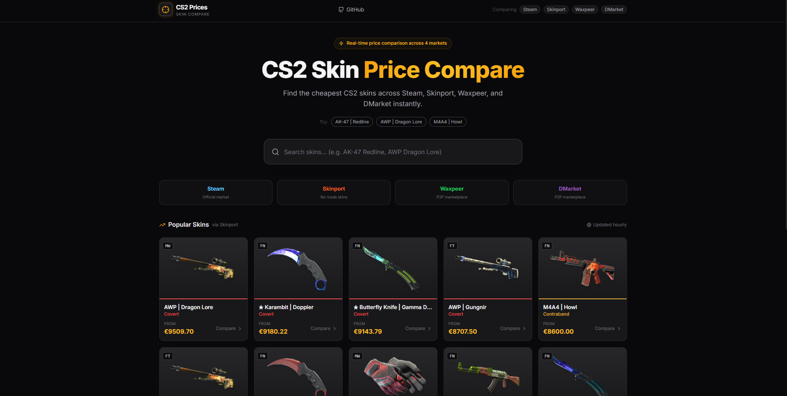
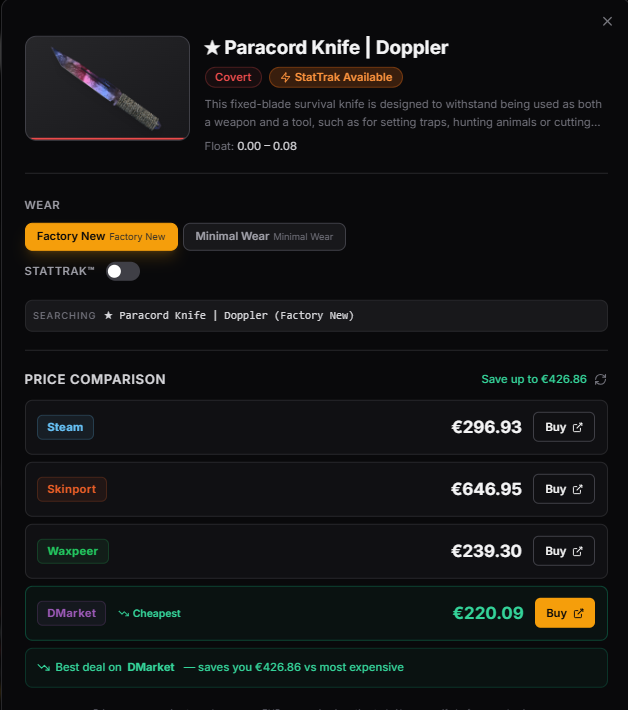

# CS2 Skin Price Compare

> Real-time price comparison for CS2 skins across Steam, Skinport, Waxpeer, and DMarket.

---

## Screenshots

### Home — Popular Skins


### Price Comparison Modal


---

## Features

- **Autocomplete search** across 10,000+ CS2 skins (300ms debounce)
- **Popular skins** grid ranked by value from Skinport's live inventory
- **Wear selector** — FN / MW / FT / WW / BS per skin
- **StatTrak toggle** where available
- **Price comparison** across 4 markets fetched in parallel
- **Cheapest market** highlighted with savings calculation
- **Direct buy links** to each marketplace
- Dark CS2-inspired theme with amber accents

---

## Tech Stack

| Layer | Technologies |
|-------|-------------|
| Frontend | React 18, Vite, TypeScript, Tailwind CSS, Shadcn/ui |
| State | TanStack Query, React Router |
| Backend | Express.js (Node.js) — API proxy with in-memory caching |

---

## Getting Started

### Install dependencies

```bash
# Install everything at once from the project root
npm run install:all
```

Or manually:

```bash
npm install
cd backend && npm install && cd ..
cd frontend && npm install && cd ..
```

### Run in development

```bash
# From the project root — starts both servers concurrently
npm run dev
```

| Server | URL |
|--------|-----|
| Frontend | http://localhost:5173 |
| Backend API | http://localhost:3001 |

Or start them separately:

```bash
# Terminal 1
cd backend && npm run dev

# Terminal 2
cd frontend && npm run dev
```

---

## API Reference

| Endpoint | Description |
|----------|-------------|
| `GET /api/items/search?q=QUERY` | Autocomplete skin search |
| `GET /api/items/popular` | Top 20 most valuable Skinport items |
| `GET /api/prices?name=MARKET_HASH_NAME` | Prices from all 4 markets in parallel |
| `GET /api/health` | Health check |

---

## Caching

| Data | TTL |
|------|-----|
| Skins database (ByMykel) | 24 hours |
| Skinport items list | 1 hour |
| Steam price lookups | 60 seconds |

---

## Project Structure

```
cs2-skin-comparison/
├── package.json              # Root: runs both servers with concurrently
├── backend/
│   ├── package.json
│   └── server.js             # Express API proxy — all routes + caching
└── frontend/
    └── src/
        ├── components/       # Header, SearchBar, SkinCard, PriceTable
        ├── components/ui/    # Shadcn UI primitives
        ├── pages/            # Home page
        ├── lib/              # API client, utilities
        └── types/            # TypeScript interfaces
```

---

## Notes

- **Waxpeer** and **DMarket** prices are in USD, converted to EUR at ~0.92 rate
- Steam rate-limits its Market API — the 60s cache helps avoid 429s
- For production, replace hardcoded conversion rates with a live exchange rate API

---

## License

MIT
